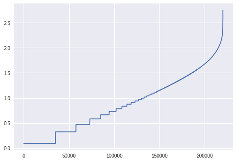

# Zipf's Law

*Zipf's law states that given a large sample of words used, the frequency of any word is inversely proportional to its rank in the frequency table. So word number n has a frequency proportional to 1/n.* 

*Thus the most frequent word will occur about twice as often as the second most frequent word, three times as often as the third most frequent word, etc.*


Validating the Zipf's Law on the [Wikitext 103](https://blog.einstein.ai/the-wikitext-long-term-dependency-language-modeling-dataset/) dataset with 28,475 articles and 103,227,021 words in all.

The word counts of the top 25 frequency words in the dataset:

```
the	6453538
of	2749031 // about half as often as the prev freq
and	2511087
in	2181008
to	1999093 
a	1776858 // about half as often as the prev few freq
was	1078442
on	770732
as	726885
for	701021
that	692598  // about half as often as the prev few freq
with	652000
by	632374
is	517792
his	466153
at	462607
he	460312
it	446728
from	446216
were	355924  // about half as often as the prev few freq
an	322067
had	293800
which	276417
be	237966
this	217380
```


This is an example of a simple Map Reduce job that can be run locally for a dataset of around 1GB in size. It does not use a custom partitioner and uses per task tally of the words using a HashMap.


### Sorting and plotting

Since this particular dataset is not too large, the sorting can be done using the following nix command in the output directory.

```
cat part-* | sort -r -nk 2 >> sorted.txt
```

The plot can be made using a simple Python program:

``` python
import pandas as pd
import numpy as np
import matplotlib.pyplot as plt
# plotting log of the frequency vs the rank
data = pd.read_csv('sorted.txt', sep='\t', header=None)
data[1] = np.log(data[1])
data['index'] = np.log(range(len(data[1])))
data = data[1:]
data[1].plot()
```




### Running the program

This is a Hadoop project built using Maven. The pom.xml file is also provided for all the dependencies.

The input arguments to the program must include `input_file ` and `output_folder`.

Can be run with any text input file and will generate a count of all the word tokens in it (starting with characters a-z or A-Z)